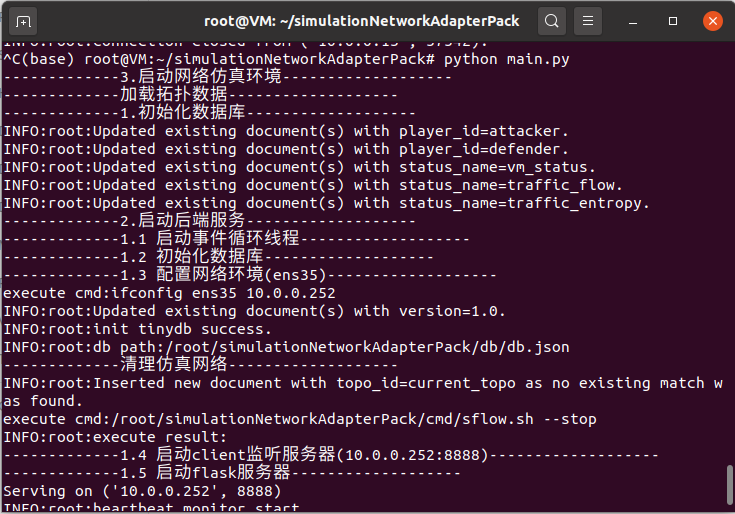

## install
```shell
pip install -r requirements.txt
```
## start
> run the main program
```shell
python main.py
```
>result


## question
please send the github issues.
[github link](https://github.com/righstar2020/simulationNetworkAdapterPack)
